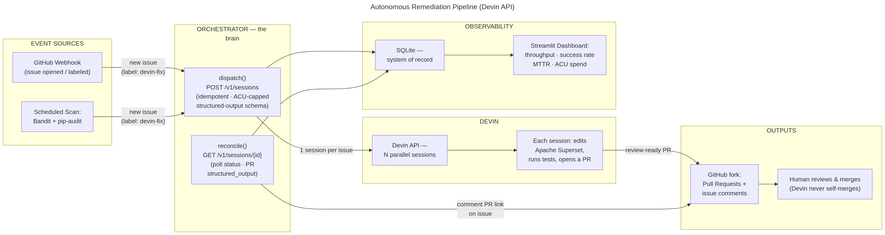

# Autonomous Remediation Pipeline — powered by Devin

> Event-driven automation that clears an engineering team's **security & dependency
> backlog** on Apache Superset. A scan files issues → an orchestrator dispatches a
> **Devin session per issue** → Devin fixes the code, runs tests, and opens a PR →
> status flows back to the issue and a **live observability dashboard**. Humans only
> review PRs.

Built for the Cognition take-home. Optimised for a *working end-to-end demo*.

---

## Why this matters (the pitch)

Every engineering org carries a backlog of security findings and dependency
upgrades that never gets cleared — it's low-status toil that loses to feature work
every sprint. Tools like Dependabot/Renovate can *bump a version*, but they can't
**fix the breakage the bump causes, adapt the calling code, or repair the tests.**

Devin closes that loop. This system treats Devin as a **fleet primitive**: N
findings become N autonomous engineers working in parallel, each producing a
review-ready PR with passing tests — observable end-to-end by an engineering leader.

---

## Architecture



<details><summary>ASCII version</summary>

```
   EVENT SOURCE                 ORCHESTRATOR (brain)              OBSERVABILITY
 ┌───────────────┐          ┌───────────────────────┐         ┌──────────────┐
 │ scan_and_file │  issues  │ dispatch():           │ Devin   │  Streamlit   │
 │ Bandit +      ├─────────▶│  issue -> POST        ├────────▶│  dashboard   │
 │ pip-audit     │ (GitHub  │  /v1/sessions         │ v1 API  │ KPIs + table │
 │  └ fixtures   │  labels) │  (idempotent, ACU-cap)│         │ MTTR · ACU · │
 └───────────────┘          │ reconcile():          │◀────────┤ success rate │
        ▲                   │  GET /v1/sessions/{id}│  poll   └──────┬───────┘
        │ (also: GitHub     │  -> status + PR +     │                │
        │  webhook in prod) │     structured_output │         reads  │ SQLite
        │                   │  -> comment issue     │◀───────────────┘ (system
        └───────────────────┤  -> persist (SQLite)  │                  of record)
          PR link back      └───────────────────────┘
```

</details>

### Key design decisions (the "How")
1. **Devin as a fleet, not a call.** One session per issue, dispatched in
   parallel, each tracked independently. → `src/orchestrator.py`
2. **Structured-output contract.** Each session is given a JSON Schema
   (`structured_output_schema`) so its result is *machine-readable*
   (`status, root_cause, files_changed, tests_passing, pr_url, confidence`) — the
   orchestrator never scrapes prose. → `src/prompts.py`
3. **Idempotency & concurrency caps.** `idempotent=true` + an issue→session map in
   SQLite means re-running never double-dispatches; `MAX_CONCURRENCY` bounds
   in-flight work. → `src/store.py`
4. **Cost governance.** `max_acu_limit` caps spend per session; ACU spend is
   surfaced on the dashboard. A VP cares this can't run away.
5. **Human-in-the-loop.** Devin opens PRs; it never self-merges.
6. **Poll-based reconciler.** Devin can't be forced to push updates, so we poll
   `GET /v1/sessions/{id}` every `POLL_INTERVAL`s over a clean state machine
   (`working → finished/blocked/expired`).

---

## Quickstart

### Option A — fully offline demo (no keys, no ACUs)
Proves the whole loop using a built-in Devin simulator + fixture issues.
```bash
pip install -r requirements.txt
DEVIN_SIMULATE=true python -m src.orchestrator once   # dispatch (sim sessions)
DEVIN_SIMULATE=true python -m src.orchestrator once   # reconcile -> PRs appear
DEVIN_SIMULATE=true streamlit run dashboard/app.py     # open http://localhost:8501
```
(or just `make sim-demo`)

### Option B — live, with Docker (recommended for the real demo)
```bash
cp .env.example .env        # fill in DEVIN_API_KEY, GITHUB_TOKEN, GITHUB_REPO
make scan                   # EVENT: file issues into your fork (or use fixtures)
docker compose up --build   # orchestrator loop + dashboard at :8501
```
Open **http://localhost:8501** and watch issues move working → PR opened.

### Option C — live, local (no Docker)
One command runs orchestrator + webhook + dashboard:
```bash
python3 -m venv .venv && . .venv/bin/activate && pip install -r requirements.txt
cp .env.example .env        # fill in keys
make scan                   # file issues (once)
./run_local.sh              # orchestrator + webhook(:8000) + dashboard(:8501)
```
> **Behind a corporate TLS-inspection proxy** (Zscaler/Netskope, "self-signed
> certificate in chain")? Such proxies break `pip`/HTTPS *inside* Docker
> containers. The host already trusts the corporate CA, so use this local path
> (`run_local.sh`) instead of `docker compose`. The Dockerfile itself is correct
> on any normal network.

---

## How each deliverable maps

| Challenge requirement | Where |
|---|---|
| **Triggered by an event** | Real-time: `src/webhook.py` (GitHub `issues` webhook → instant dispatch). Batch: `scripts/scan_and_file.py` (scan → issues). |
| **Programmatically manage Devin sessions** | `src/devin_client.py` + `src/orchestrator.py` (create, poll, comment, steer) |
| **Observable outputs** | GitHub PRs + issue comments; Streamlit dashboard (`dashboard/app.py`) |
| **Observability / analytics** | KPIs: throughput, success rate, MTTR, ACU spend, status & finding-type breakdown |
| **Dockerised** | `Dockerfile` + `docker-compose.yml` (orchestrator + dashboard, shared volume) |
| **Forked Superset + issues** | `make scan` files them; fixtures in `fixtures/findings.json` |

---

## Real-time trigger (GitHub webhook)

The scheduled scan is the *batch* event source; `src/webhook.py` is the
*real-time* one. A GitHub `issues` webhook (opened / labeled / reopened) fires an
**instant** Devin dispatch — no waiting for the next scan or poll. Both paths
funnel into the same `Orchestrator.dispatch_one()`.

```bash
make webhook                     # runs FastAPI on :8000  (docker compose runs it too)
ngrok http 8000                  # expose it for GitHub (dev)
```
Then in your fork: **Settings → Webhooks → Add webhook**
- Payload URL: `https://<your-ngrok>/webhook/github`
- Content type: `application/json`
- Secret: same value as `GITHUB_WEBHOOK_SECRET` in `.env`
- Events: **Issues**

Now labeling any issue `devin-fix` dispatches Devin within seconds. Payloads are
authenticated via HMAC-SHA256 when the secret is set. Health check: `GET /health`.

---

## Configuration (`.env`)

| Var | Purpose |
|---|---|
| `DEVIN_API_KEY` | Devin API key (`apk_…`) |
| `DEVIN_MAX_ACU` | Per-session ACU ceiling (cost guard) |
| `DEVIN_SIMULATE` | `true` = run against the offline simulator |
| `GITHUB_TOKEN` / `GITHUB_REPO` | `repo`-scoped token + your `user/superset` fork |
| `TARGET_LABEL` | Issue label that triggers remediation (default `devin-fix`) |
| `POLL_INTERVAL` / `MAX_CONCURRENCY` | Reconcile cadence + in-flight cap |
| `SUPERSET_PATH` | Local Superset checkout to scan (optional; else fixtures) |

---

## Repo layout
```
src/devin_client.py    Devin v1 API wrapper (+ simulate hook)
src/github_client.py   GitHub issues/comments/labels (+ fixture fallback)
src/prompts.py         Scoped prompt + structured-output JSON Schema
src/orchestrator.py    dispatch / reconcile / loop  (the brain)
src/webhook.py         FastAPI receiver: real-time GitHub issue trigger
src/store.py           SQLite system-of-record
src/simulator.py       Deterministic offline Devin
scripts/scan_and_file.py   Batch event source: Bandit/pip-audit -> GitHub issues
dashboard/app.py       Streamlit observability dashboard
fixtures/findings.json Sample findings (offline + fallback)
docs/architecture.png  Architecture diagram
```

---

## Extending in a real customer engagement (the "When")
- **More event sources**: the GitHub webhook is built (`src/webhook.py`); the same
  receiver pattern extends to ServiceNow / Jira / CodeQL / Snyk scan-complete events.
- **Severity routing**: auto-merge low-risk fixes that pass CI above a confidence
  threshold; escalate the rest to a named reviewer.
- **CI gating**: block the comment-back until the PR's checks go green.
- **Multi-repo / fleet**: one config per repo; the dashboard already aggregates.
- **Devin telemetry**: enrich KPIs from Devin's own consumption/metrics API
  (`/v3/.../consumption/*`, `/metrics/prs`) for true cost-per-fix reporting.

---

_Devin opens PRs; humans merge. Nothing here self-merges._
